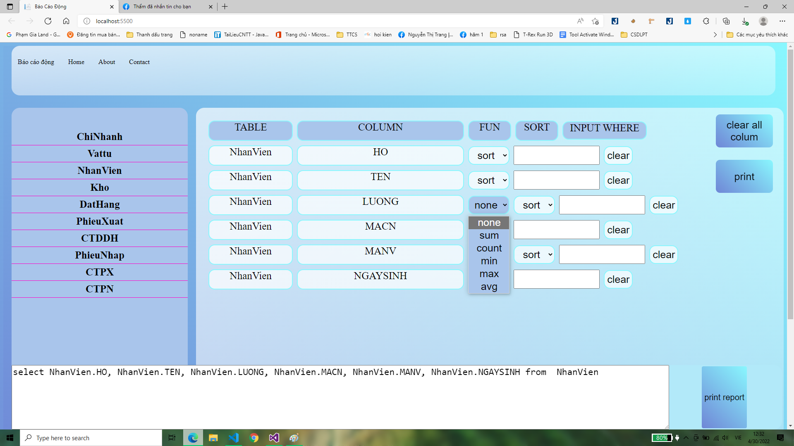

# PTIT_bao-cao-dong_ASP.NET

## Yêu cầu
    - Tạo một website thân thiện với người dùng. dễ dàng thao tác sử dụng với các thao tác click
    - Tự động sinh ra các câu query cho người dùng thấy khi họ click chọn các column trong các table và có thể chỉnh sửa nếu phần mềm lỗi
    - Có chức năng sum, count, min, max, average để hỗ trợ người dùng tổng hợp thông tin
    - Có chức năng sắp xếp để người dùng dễ dàng sắp xếp, liệt kê các hàng trong báo cáo
    - Có thể xuất file, in file báo cáo
## Hệ thống
    - Visual Studio 2015
    - Microsoft SQL Server 2014
    - Xtrareport( Devexpress)
## Ngôn ngữ sử dụng
    - C#( ASP.NET + MVC)
    - Html + CSS
    - Javascript
## Các kiến thức sử dụng
    - Kết nối đến SQL server bằng thư viện System.Data.SqlClient
    - Sử dụng SQL command để truyền query đến SQL Server
    - Sử dụng SQL datatable & SQL datareader để nhận và đọc dữ liệu từ SQL Server trả về
## Tinh chỉnh file
    B1: Mở file MVC_TTCS.sln bằng Microsoft SQL Server 2014
    B2: Mở Solution Explorer -> Controllers -> HomeController
    B3: Đến dòng 231 sửa user, passwork và database
    B4: Start Debugging hoặc F5
## Sử dụng
    -B1: Hover vào table và chọn các column bạn muốn có trong table. column nào đã chọn sẽ chuyển sang màu xám không chọn lại được.

    -B2: Sau khi chọn xong thì sẽ chọn các chức năng (sum, count, min, max, averagr) hay sắp xếp( asc, desc), hoặc có thể lọc danh sách theo các điều kiện khi nhập vào trong ô input. lưu ý chỉ những column có giá trị là số thì mới có thể sử dụng các phép toán sum, count, min, max,...

    -B3: Nếu có điều kiện lọc thì nhấn nút print để sinh câu query loc. nếu không thì bỏ qua bước này.
    -B4: Nhấn print report để in báo cáo. Nếu muốn xóa tất cả column đi để làm lại thì có thể nhấn "clear all column" để xóa hết các column đã chọn
->>>> Báo cóa preview

    -B5: Nếu muốn in thì sẽ chọn biểu tượng in trên thanh bar trên cùng
###Lưu ý: nếu quẻy sai sẽ báo alert lỗi. Khi đó bnaj hãy nhấn ok và load lại trang

#### Giảng viên hướng dẫn:  Lưu Nguyễn Kỳ Thư, Huỳnh Trung Trụ
#### Giáo viên phản biện: Huỳnh Trung Trụ
#### Sinh viên báo cáo: Nguyễn Trọng Sơn
